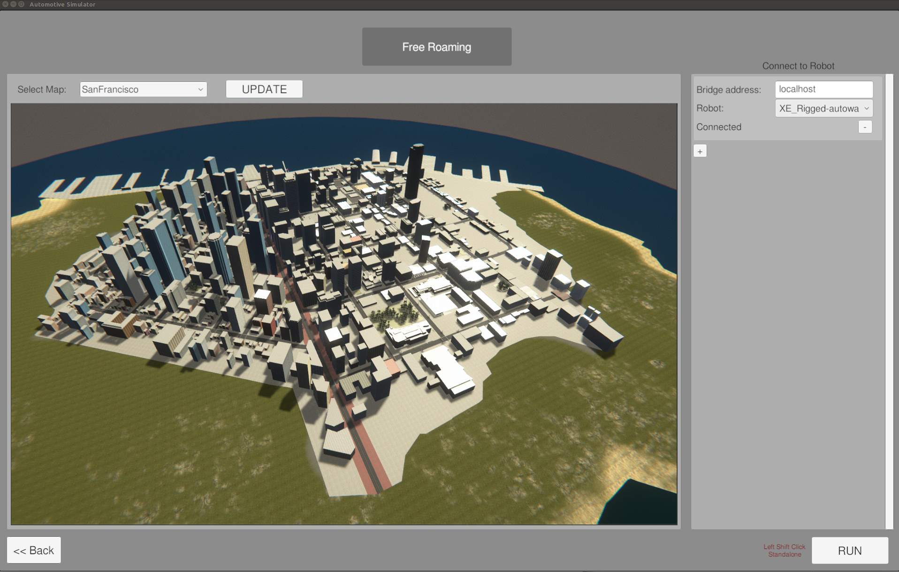
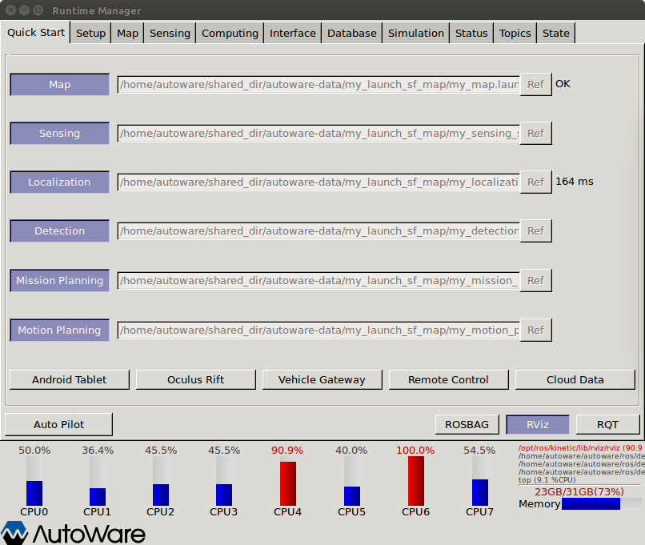
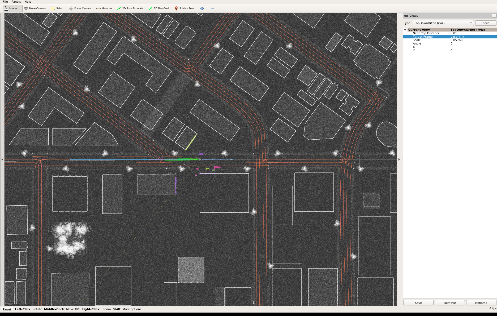

# Autoware with LG SVL Simulator

## Table of Contents

[General](#general)

[Setup](#setup)

- [Requirements](#requirements)

- [Docker image setup](#docker-image-setup)

- [Simulator Installation](#simulator-installation)

[Launching Autoware alongside Simulator](#launching-autoware-alongside-lg-svl-simulator)

[Copyright and License](#copyright-and-license) 

## General

This guide goes through how to run Autoware with the LG SVL Simulator.

This [link](https://github.com/lgsvl/Autoware) leads to our fork of the ROS-based open-source software Autoware. The repository contains various fixes and changes on top of Autoware to allow running it with LG Silicon Valley Lab's Autonomous Driving Simulator. 

This fork of Autoware is currently rebased on Autoware release 1.9.0.

In order to run Autoware with the LGSVL simulator, it is easiest to build and run a custom Docker image. It will also be necessary to clone LGSVL's [autoware-data](https://github.com/lgsvl/autoware-data) repository, which contains the HD maps, point cloud maps, and launch scripts needed to run Autoware in the simulator's default San Francisco environment. 

Autoware communicates with the simulator using the rosbridge_suite, which provides JSON interfacing with  ROS publishers/subscribers. 

## Setup

### Requirements

- Linux operating system
- Nvidia graphics card

### Docker image setup

We recommend using a Docker container to run Autoware. We do not currently provide an image on Docker Hub, so it is necessary to build the Docker image first manually. 

#### Installing Docker CE

To install Docker CE please refer to the [official documentation](https://docs.docker.com/install/linux/docker-ce/ubuntu/). We also suggest following through with the [post installation steps](https://docs.docker.com/install/linux/linux-postinstall/).

#### Installing Nvidia Docker

Before installing nvidia-docker make sure that you have an appropriate Nvidia driver installed. To test if nvidia drivers are properly installed enter `nvidia-smi` in a terminal. If the drivers are installed properly an output similar to the following should appear.

```
    +-----------------------------------------------------------------------------+
    | NVIDIA-SMI 390.87                 Driver Version: 390.87                    |
    |-------------------------------+----------------------+----------------------+
    | GPU  Name        Persistence-M| Bus-Id        Disp.A | Volatile Uncorr. ECC |
    | Fan  Temp  Perf  Pwr:Usage/Cap|         Memory-Usage | GPU-Util  Compute M. |
    |===============================+======================+======================|
    |   0  GeForce GTX 108...  Off  | 00000000:65:00.0  On |                  N/A |
    |  0%   59C    P5    22W / 250W |   1490MiB / 11175MiB |      4%      Default |
    +-------------------------------+----------------------+----------------------+
                                                                                
    +-----------------------------------------------------------------------------+
    | Processes:                                                       GPU Memory |
    |  GPU       PID   Type   Process name                             Usage      |
    |=============================================================================|
    |    0      1187      G   /usr/lib/xorg/Xorg                           863MiB |
    |    0      3816      G   /usr/bin/gnome-shell                         305MiB |
    |    0      4161      G   ...-token=7171B24E50C2F2C595566F55F1E4D257    68MiB |
    |    0      4480      G   ...quest-channel-token=3330599186510203656   147MiB |
    |    0     17936      G   ...-token=5299D28BAAD9F3087B25687A764851BB   103MiB |
    +-----------------------------------------------------------------------------+
```

The installation steps for nvidia-docker are available at the [official repo](https://github.com/NVIDIA/nvidia-docker).

#### Building LGSVL Autoware Docker image

Cloning requires instaling Git LFS. If you do not already have Git LFS installed, follow these [instructions](https://git-lfs.github.com/). 

Clone this repository to your home directory, making sure to checkout the `lgsvl_develop` branch:

```
$ git clone --recurse-submodules git@github.com:lgsvl/autoware.git -b lgsvl_develop
```

Build the Docker image. This should take some time.

```
$ cd autoware/docker/generic
$ ./build.sh kinetic
```

You should now have a Docker image named `autoware-kinetic`.

We also need LGSVL's autoware-data repository, which contains map files and launch scripts for running with the simulator. This repository also uses Git LFS.

Clone the autoware-data repository:

```
$ mkdir ~/shared_dir && cd ~/shared_dir
$ git clone git@github.com:lgsvl/autoware-data.git
```

You are now ready to bring up a Docker container and run Autoware. Launch the container:

```
$ cd ~/autoware/docker/generic
$ ./run.sh kinetic
```

You should now be logged into the container under the username `autoware`.

### Simulator installation

Follow the instructions on our simulator Github page [here](https://github.com/lgsvl/simulator).

## Launching Autoware alongside LG SVL Simulator

To launch Autoware, first bring up the Docker container as described in the previous section. 

Inside the container, run Autoware:

```
autoware@[MY_DESKTOP]:~$ cd ~/autoware/ros
autoware@[MY_DESKTOP]:~$ ./run
```

A few terminals will open, as well as a GUI for the runtime manager. In the runtime manager, click on the 'Quick Start' tab and load the following launch files from `~/shared_dir/autoware-data/my_launch_sf_map/` by clicking "Ref" to the right of each text box:

- `my_map.launch`
- `my_sensing_simulator.launch`
- `my_localization.launch`
- `my_detection.launch`
- `my_mission_planning.launch`
- `my_motion_planning.launch`


Click "Map" to load the launch file pertaining to the HD maps. An "Ok" should appear to the right of the "Ref" button when successfully loaded. Then click "Sensing" which brings up rosbridge. 

Run the LG SVL simulator, choosing "SanFrancisco" map and "XE_Rigged-autoware" for Robot. After "my_sensing_simulator.launch" has been loaded, the simulator should show "Connected", showing that the simulator has established a connection with the rosbridge server. 



Click "Run" to start, and a vehicle should appear in the streets of San Francisco. On the left, click the check boxes for "Enable GPS" and "Enable LIDAR". 

In the Autoware Runtime Manager, continue loading the other launch files - click "Localization" and wait for the time to display to the right of "Ref". Then click "Detection," "Mission Planning", then "Motion Planning". 



Then click "Rviz" to launch Rviz - the vector map and location of the vehicle in the map should show. 

To see the vehicle drive, click "2D Nav Goal" in Rviz, then click a destination point and drag slightly in a feasible direction (in the direction of the driving lane) to give a goal destination pose to the planner. The vehicle should plan a path and begin driving towards the destination.



You should see something similar in RViz to the above when the vehicle successfully starts navigating using Autoware.


##  Copyright and License

This software contains code licensed as described in LICENSE.
