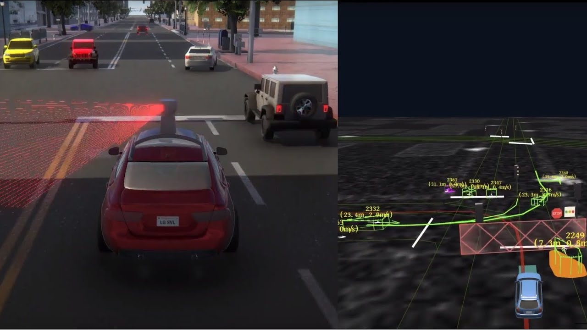

<h1 align="center">LGSVL Simulator:  An Autonomous Vehicle Simulator</h1>

<div align="center">
<a href="https://github.com/lgsvl/simulator/releases/latest">
</a>
<a href="">
</a>
</div>
<div align="center">
  <h4>
    <a href="https://lgsvlsimulator.com" style="text-decoration: none">
    Website</a>
    <span> | </span>
    <a href="https://lgsvlsimulator.com/docs" style="text-decoration: none">
    Docs</a>
    <span> | </span>
    <a href="https://github.com/lgsvl/simulator/releases/latest" style="text-decoration: none">
    Download</a>
  </h4>
</div>

## Introduction


LG Silicon Valley Lab has developed a Unity-based multi-robot simulator for autonomous vehicle developers. We provide an out-of-the-box solution which can meet the needs of developers wishing to focus on testing their autonomous vehicle algorithms. It currently has integration with the [Duckietown](https://github.com/lgsvl/duckietown2), TierIV's [Autoware](https://github.com/lgsvl/Autoware), and Baidu's [Apollo](https://github.com/lgsvl/apollo) platforms, can generate HD maps, and be immediately used for testing and validation of a whole system with little need for custom integrations. We hope to build a collaborative community among robotics and autonomous vehicle developers by open sourcing our efforts. 

*To use the simulator with Apollo, after following the [build steps](build-instructions.md) for the simulator, follow the guide on our [Apollo fork](https://github.com/lgsvl/apollo).*

*To use the simulator with Autoware, build the simulator then follow the guide on our [Autoware fork](https://github.com/lgsvl/Autoware).*


## Video

[](https://www.youtube.com/watch?v=NgW1P75wiuA&)

([Link](https://www.youtube.com/watch?v=NgW1P75wiuA&))


## Getting Started

Running the simulator with reasonable performance and frame rate (for perception related tasks) requires a high performance desktop. Below is the recommended system for running the simulator at high quality. We are currently working on performance improvements for a better experience. 

**Recommended system:**

- 4 GHz Dual core CPU
- Nvidia GTX 1080
- Windows 10 64 Bit

The easiest way to get started with running the simulator is to download our [latest release](https://github.com/lgsvl/simulator/releases/latest) and run as a standalone executable.

For the latest functionality or if you want to modify the simulator for your own needs, you can checkout our source, open it as a project in Unity, and run inside the Unity Editor. Otherwise, you can build the Unity project into a standalone executable.

Currently, running the simulator in Windows yields better performance than running on Linux. 

### Downloading and starting simulator

1. Download the latest release of the LGSVL Simulator for your supported operating system (Windows or Linux) here: [https://github.com/lgsvl/simulator/releases/latest](https://github.com/lgsvl/simulator/releases/latest)
2. Unzip the downloaded folder and run the executable.

### Steps for starting simulator in Unity Editor

1. Install Unity 2018.2.4. Windows link: https://unity3d.com/get-unity/download/archive

   Linux link (2018.2.4f1): https://beta.unity3d.com/download/fe703c5165de/public_download.html

2. Install [Git LFS](https://git-lfs.github.com/) (this should be as simple as `git lfs install`). Since this repository contains several large files, we speed up clones/uploads with Git LFS. This is a requirement for cloning our project, and without it the repository cannot be set up properly. 

3. Clone this repository from Github:

    ```
      git clone https://github.com/lgsvl/simulator.git
    ```

4. Open Unity Editor by navigating to where it is installed and launching the Unity executable.

5. Open the simulator project that was cloned in step 3 by selecting the simulator folder.

6. Run the simulator. On the bottom left in the Project panel, Navigate to Assets->Scenes. Then double-click "Menu" (with the Unity icon next to it) to load the scene. At the top of the editor, click the Play button to start the simulator.


### Build standalone executable

If you would prefer to not run in Unity Editor and build the standalone executable yourself, follow the instructions [here](build-instructions.md).


## Simulator Instructions

1. After starting the simulator, you should see the main menu. Currently, only Free Roaming mode is supported. Click "Free Roaming." 
2. Select the appropriate map and vehicle.  For a standard setup, select "SanFrancisco" for map and "XE_Rigged-apollo" for Robot. If connecting with Autoware or Apollo, make sure simulator establishes connection with rosbridge. Click "Run" to begin. The program will not allow running if there is no established connection with a rosbridge. To bypass this and just test out the simulator environment, hold down the Shift button and click "Run."
3. The vehicle/robot should spawn inside the map environment that was selected. Read [here](keyboard-shortcuts.md) for an explanation of all current keyboard shortcuts and controls.
4. Follow the guides on our respective [Autoware](https://github.com/lgsvl/Autoware) and [Apollo](https://github.com/lgsvl/apollo) repositories for instructions on running the platforms with the simulator.


### Guide to simulator functionality

Look [here](keyboard-shortcuts.md) for a guide to currently available functionality and keyboard shortcuts for using the simulator.


## Contact

Please feel free to provide feedback or ask questions by creating a Github issue. For inquiries about collaboration, please email us at <contact@lgsvlsimulator.com>.


## Copyright and License

Copyright (c) 2018 LG Electronics, Inc.

This software contains code licensed as described in LICENSE.